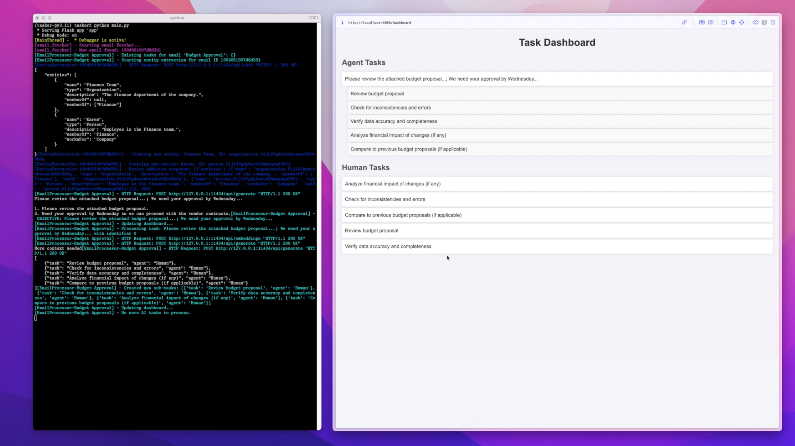
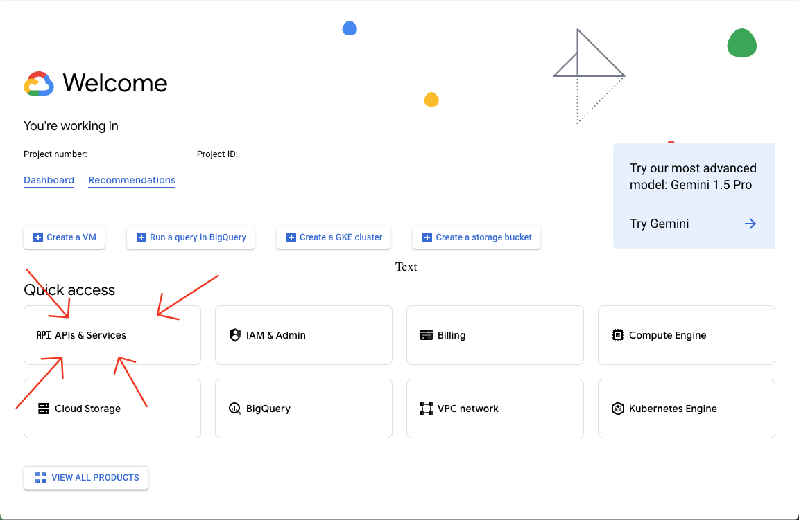
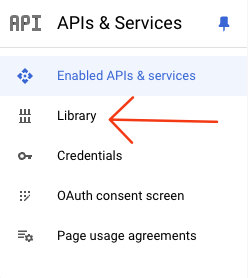
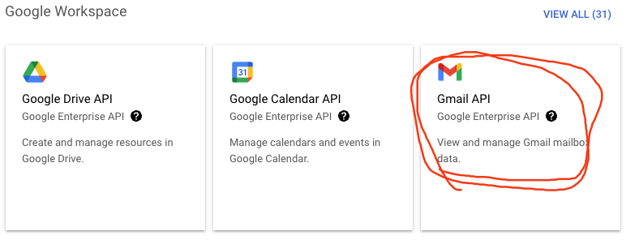
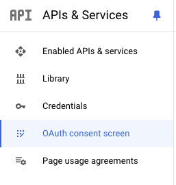
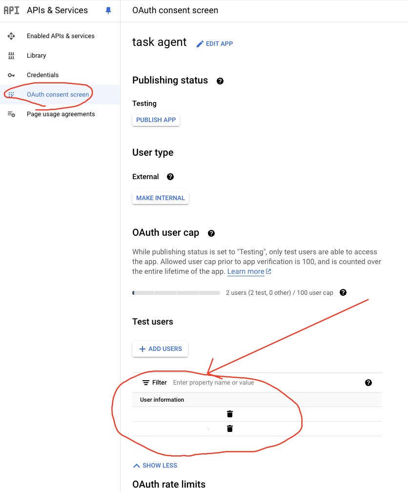
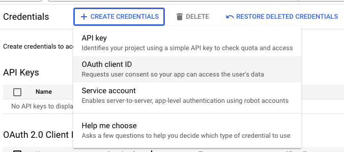
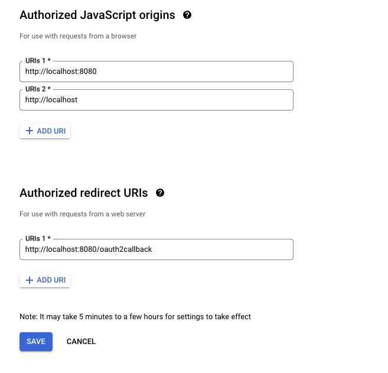
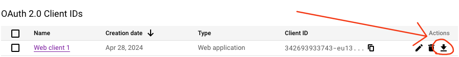
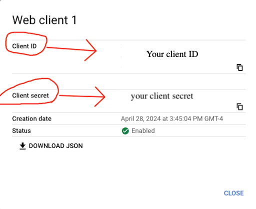

# Task Agent Starter Kit with NexusDB



## Table of Contents

- [Task Agent Starter Kit with NexusDB](#task-agent-starter-kit-with-nexusdb)
  - [Table of Contents](#table-of-contents)
  - [Setup](#setup)
    - [Connecting to Gmail](#connecting-to-gmail)
      - [Step 1: Create a Project and Enable the Gmail API](#step-1-create-a-project-and-enable-the-gmail-api)
      - [Step 2: Configure OAuth Consent Screen](#step-2-configure-oauth-consent-screen)
      - [Step 3: Create Credentials](#step-3-create-credentials)
    - [Configure The AI Models](#configure-the-ai-models)
      - [Step 1: Install Ollama](#step-1-install-ollama)
    - [Environment Variables](#environment-variables)
      - [NexusDB API Key](#nexusdb-api-key)
      - [Max Threads](#max-threads)
      - [Initial Emails](#initial-emails)
  - [Installation](#installation)
  - [Running the app](#running-the-app)
    - [Using Poetry Shell](#using-poetry-shell)
    - [Using Poetry Run](#using-poetry-run)
  - [Contributing](#contributing)
  - [License](#license)
    - [Non-Compete Open License](#non-compete-open-license)
    - [Permissions](#permissions)
    - [Conditions](#conditions)
    - [Summary](#summary)
  - [NexusDB](#nexusdb)
    - [Earn 30% Commission on referrals](#earn-30-commission-on-referrals)
    - [Partner with us](#partner-with-us)

## Setup

To run this application there are a few items that must be set up separately:

- Gmail: For the app to connect to your Gmail account securely, you should create your own API credentials. We'll walk through the steps to create an application in Google Cloud and enable the Gmail API.
- AI Models: This application uses [Llama 3](https://ai.meta.com/blog/meta-llama-3/) for the AI agents and [mxbai-embed-large](https://www.mixedbread.ai/docs//mxbai-embed-large-v1#model-description), which are not included as part of the application and must be downloaded separately. Like with Gmail, the steps for setting this up are below.

### Connecting to Gmail

#### Step 1: Create a Project and Enable the Gmail API

1. Navigate to [Google Cloud Console](https://console.cloud.google.com/).
2. Create a new project if you don't already have one.
3. Enable the Gmail API: In the navigation menu, select “APIs & Services” -> “Library”

   It might not look like this, you may have to search for it in the search bar at the top.

   

   

4. Search for “Gmail API” and enable it for your project.

   

#### Step 2: Configure OAuth Consent Screen

1. In the Google Cloud Console, go to “OAuth consent screen” under “APIs & Services”.

   

2. Set the User Type to “External” and create.
3. Fill in the required fields like App name, User support email, and Developer contact information.
4. Save and continue until you finish the setup.

   _Note: be sure to add yourself as a test user_
   

#### Step 3: Create Credentials

1. In the Google Cloud Console, under “Credentials” (still within “APIs & Services”), click “Create Credentials” and choose “OAuth Client ID”.

   

2. Select “Web application” as the Application type and give it a name.
3. Add `http://localhost` and `http://localhost:8080/` as authorized JavaScript origins

   _Note, Google only allows localhost for testing, which is why main.py sets this as host instead of default Flask 127.0.0.1. If you want to use a different port, be sure to make the change here as well as main.py_

4. Add `http://localhost:8080/oauth2callback` as authorized redirect URI.

   Your setup should look like this:

   

5. After creating the credentials, click the download button to get your credentials:

   

   

6. Copy and paste your Google Client ID and Client Secret into the .env file at the root of your project.
7. **If you don't rename the file from `.env.example` to `.env` you will get an error! Don't miss this step!**

### Configure The AI Models

#### Step 1: Install Ollama

1. Go to [Ollama website](https://ollama.com/) and download the application.
2. After installing, run the following commands in your terminal:

   ```bash
   ollama pull llama3
   ollama pull mxbai-embed-large
   ```

   More on each model here:

   - [Llama 3](https://ai.meta.com/blog/meta-llama-3/)
   - [mxbai-embed-large](https://www.mixedbread.ai/docs//mxbai-embed-large-v1#model-description)

3. Optionally, you can test the installation by running:

   ```bash
   ollama run llama3
   ```

4. If you want to run more than 1 agent in parallel (recommended), you'll have to configure the ollama server to do so. Make sure the ollama application is not running, then start it yourself in a terminal window using the command:

   ```bash
   OLLAMA_NUM_PARALLEL=4 ollama serve
   ```

this will start the ollama server with the number of parallel processes = 4. You can choose any number you'd like, but it's recommended to set this number to double that of the MAX_THREADS environment variable, which we'll discuss in more detail later.

### Environment Variables

**Make sure you have renamed the file from `.env.example` to `.env` or you will get an error!**

#### NexusDB API Key

This app runs on NexusDB, so if you don't have an API key yet, go to [nexusdb.io](https://www.nexusdb.io) and sign up for an account. After signing up you will be able to get your API key from the dashboard and paste it into .env

#### Max Threads

The MAX_THREADS variable determines the number of emails that can be processed simultaneously. To allow the task agent and graph creation agents to run concurrently for each email, you should set the ollama server to run twice this number of parallel processes

#### Initial Emails

This variable sets the number of emails in the inbox the application should add to the queue before waiting for new ones to come in.

## Installation

1. If you don't have Poetry installed, do that first:

   - **Install Poetry**:
     Poetry provides an easy way to install itself. Run the following command:

     ```bash
     curl -sSL https://install.python-poetry.org | python3 -
     ```

     Alternatively, you can follow the instructions on the [Poetry documentation](https://python-poetry.org/docs/)

2. Clone the repository

3. Install Dependencies

   Navigate to the project directory and install project dependencies

   ```bash
   poetry install
   ```

## Running the app

To run the project, activate the Poetry shell or use Poetry's `run` command.

### Using Poetry Shell

Activate the Poetry shell:

```bash
poetry shell
```

Then, run the project in development mode:

```bash
python main.py
```

### Using Poetry Run

Alternatively, you can use the poetry run command to execute scripts without activating the shell:

```bash
poetry run python main.py
```

## Contributing

We welcome contributions! Please follow these steps to contribute to the project:

1. Fork the repository.
2. Create a new branch (git checkout -b feature-branch).
3. Make your changes and commit them (git commit -m 'Add some feature').
4. Push to the branch (git push origin feature-branch).
5. Open a pull request.

## License

### Non-Compete Open License

**Non-Compete Restriction**: This software is designed to work exclusively with NexusDB. You are not permitted to modify, change, or replace the database system used by the software.

### Permissions

You are granted the following rights, free of charge:

- **Use**: You can use the software for any purpose.
- **Copy**: You can make copies of the software.
- **Modify**: You can modify the software as long as the database system remains NexusDB.
- **Merge**: You can merge the software with other projects.
- **Publish**: You can publish the software.
- **Distribute**: You can distribute the software.
- **Sublicense**: You can sublicense the software.

### Conditions

- Any distribution of the software must include the original copyright notice and this permission notice.
- The software is provided "as-is" without any warranty, express or implied. The authors are not liable for any damages or claims arising from the use of the software.

### Summary

This license grants you broad rights to use, modify, and distribute the software, with the specific condition that the underlying database system must remain NexusDB. This ensures the software's core functionality remains intact and aligned with the intended database system.

For the full license text, please see the LICENSE file included with this project.

## NexusDB

We on the NexusDB team are building the world's first `data web`, connecting public and private information in a way that's secure, fast, flexible, and highly querable. It's also 20x faster to set up and 50% cheaper for comparable use cases than leading competitors!

Whether you need to store tables, graphs, embeddings, json objects, or blobs, NexusDB is the solution. See [documentation](https://docs.nexusdb.io) for more details.

### Earn 30% Commission on referrals

If you like NexusDB and want to spread the love, you can get paid to do so through our [referral program](https://www.nexusdb.io/affiliates)! See the website for terms and additional details.

### Partner with us

We're growing fast and are actively seeking design partners and investors! If you enjoyed this demo, we'd love to work with you and tell you about our plans. Reach out to CEO Will Humble at [w@astraanalytics.co](mailto:w@astraanalytics.co) for more info.
